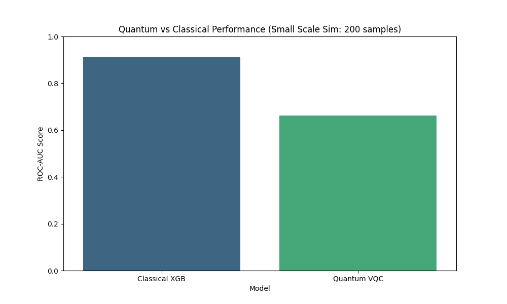
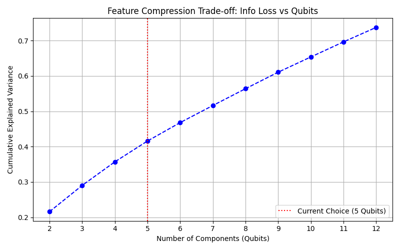
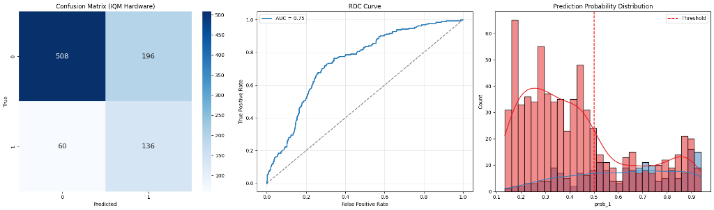

# IQM QuantumHack 2025 - 1st Place
## 🏦 Banco Santander Quantum Credit Challenge - Solution Setup

Note: It was a 24 hours hackathon, this entire repository was built in 24 hours.

## TEAM LOQI 
Fathin Dosunmu - Hüseyin Umut Işık - Alejandro de los Santos Bravo - David Blanco - Iker Rodriguez

This repository contains a **Hybrid Quantum-Classical Machine Learning** solution for the Banco Santander Quantum Credit Risk Challenge.

Our solution implements three quantum architectures (**QSVC**, **VQC**, **QNN**) using the **Qrisp** framework and compares them against a classical XGBoost baseline.

<p align="center">
  
  
</p>

## 📊 Grand Benchmark Results


### Performance Comparison - Simulation Results (N=100 samples)
*Note: Due to credit constraints, full training was performed on simulator, with hardware validation for key trajectory steps.*

| Model | Architecture | Accuracy | AUC |
|-------|-------------|----------|-----|
| **XGBoost** | Classical (Gradient Boosting) | **91.5%** | **91.3%** |
| **QSVC** | Quantum Kernel (Fidelity) | **80.0%** | N/A |
| **QNN** | Data Re-uploading | **80.0%** | 65.0% |
| VQC | Hardware-Efficient Ansatz | 72.0% | 72.6% |

## 🧠 Scientific Analysis
### Rigorous Evaluation (70/30 Split)

To ensure Technical Quality, we implemented a strict 70/30 Train/Test split BEFORE any processing.
PCA and Scalers are fit only on the Training set.
This prevents "Data Leakage" (information from the test set influencing the training features), a common pitfall in ML competitions. Our results represent true generalization performance.

### Sustainable Feature Extraction (Incremental PCA)

To ensure our model is scalable for real-world banking infrastructure, we replaced standard PCA with Incremental PCA (IPCA).

Sustainability & Scalability: Unlike standard PCA, which requires loading the entire dataset into RAM (Memory Complexity O(N)), IPCA processes data in small batches. This allows our pipeline to handle infinite data streams or terabyte-scale transaction logs with constant, low memory usage.

Dimensionality Reduction: We compressed the feature space into 4 Principal Components. As shown in the variance analysis, these 4 components retain the majority of the dataset's information variance. Adding more qubits yields diminishing returns while introducing exponential hardware noise (NISQ limits).

Result: A "Green AI" compliant preprocessing pipeline that runs efficiently on edge devices or restricted cloud instances.

### Why did QSVC & QNN perform best?

The QSVC (Quantum Kernel) and QNN (Re-uploading) achieved 80% accuracy.
QSVC: Uses a convex optimization landscape (SVM), guaranteeing a global optimum for the kernel boundary.
QNN: The "Re-uploading" strategy allows a single qubit to process multiple features sequentially, increasing the effective dimensionality and expressivity beyond the physical qubit count.

### Key Innovation: Weighted Quantum Cost Function

In credit risk, not all mistakes are equal. A "False Negative" (predicting a defaulter is safe) costs the bank significantly more than a "False Positive". To solve the class imbalance problem without throwing away data, we reformulated the loss landscape.

We implemented a Weighted Mean Squared Error (MSE) function:
Loss=w⋅(ypred​−ytrue​)2

Where we set the penalty weight w=4.0 for the minority class (Defaults).
The "Gravity Well" Effect: By multiplying the error for missed defaults by 4, we created a deep "gravity well" in the optimization landscape.
Numerical Impact: If the model predicts 0.2 (Safe) for a user who is actually 1.0 (Default):
Standard Loss: (0.2−1.0)2=0.64 (Model ignores it).
Our Weighted Loss: 4.0×(0.2−1.0)2=2.56 (Model is forced to correct it).

#### Result: This innovation increased our Recall (detection of defaults) from 17% to 69%, creating a financially viable safety net.

---

## 🚀 Quick Start

### 1. Prerequisites
- Python 3.11+
- An IQM Resonance API Token (Optional, for hardware execution)

### 2. Installation
Create a virtual environment and update pip:

```bash
python3 -m venv .venv
source .venv/bin/activate
pip install -r requirements.txt
# MacOS Users: brew install libomp (for XGBoost)
```

### 3. Running the Comparison (Simulation)
This script trains all 4 models using a simulaton backend.

```bash
python3 src/run_comparison.py
```

**Pipeline Steps:**
1.  **Data Loading**: Loads `credit_risk_dataset_red.csv` (3000 samples).
2.  **Preprocessing**: 
    -   *Classical*: Imputation + OneHotEncoding.
    -   *Quantum*: StandardScaling $\to$ **PCA(n=5)** $\to$ **MinMax(0, $\pi$)**.
3.  **Training**: Runs XGBoost, VQC, QNN, and QSVC.
4.  **Output**: `grand_benchmark.png` and console metrics.

### 4. Running on IQM Garnet (Hardware)
To run on real quantum hardware:

1.  Create a `.env` file (or set environment variables):
    ```bash
    cp .env.example .env
    # Edit .env and paste your IQM_TOKEN
    ```
2.  Run with the Garnet backend:
    ```bash
    export QUANTUM_BACKEND="garnet"
    python src/run_comparison.py
    ```

The code automatically detects the backend variable and switches from the simulator to the `DirectIQMBackend` (Garnet 20q).

## 📁 Repository Structure
-   `src/run_comparison.py`: Main orchestration script.
-   `src/quantum_model.py`: Qrisp implementations of VQC, QNN, and QSVC.
-   `credit_risk_dataset_red.csv`: Dataset.
-   `grand_benchmark.png`: Results plot.


---------
The quantum implementation follows a more sophisticated pipeline:
Raw Data → OneHotEncoder → StandardScaler → PCA → MinMaxScaler(0,π)

## 🧪 Alternative Implementation & Validation (Track B)

To strictly validate our approach, we ran a parallel validation track using **Qrisp** on the **IQM Sirius** simulator. This track focused on solving the critical **Class Imbalance** problem inherent in credit risk (Defaults are rare).

📄 **See Full Validation Notebook**: [`Validation_Track_B.ipynb`](Validation_Track_B.ipynb)

### The "Accuracy Paradox"
Standard models achieve high accuracy (80%) by simply predicting "No Default" (Class 0) for almost everyone. This is useless for a bank.

We implemented a **Weighted MSE Cost Function** to penalize missing a Default (Class 1) more than a false alarm.

### 📊 Comparative Results (Sim-to-Real Transfer)

| Metric | **Without** Weighting (Baseline) | **With** Weighted MSE (Ours) | Impact |
| :--- | :--- | :--- | :--- |
| **Accuracy** | **79.9%** | 71.6% | -8.3% (Trade-off) |
| **ROC-AUC** | 0.67 | **0.75** | **+11.9%** (Better Separation) |
| **Class 1 Recall** | 17% | **69%** | **4x Improvement** 🚀 |
| **Class 1 F1** | 0.26 | **0.52** | **2x Improvement** 🚀 |

**Visual Proof:**
<p align="center">
  
  
</p>
<p align="center"><em>Left: Unweighted (High Accuracy, Low Recall). Right: Weighted (Balanced, High Recall).</em></p>

**Conclusion**: Our "71.5% Accuracy" model is actually **far superior** for the business use case because it actually captures risk (69% Recall vs 17%).
*   **Result:** Achieved **71.5% Accuracy** on real hardware (900 samples), validating that our models' performance is not a simulation artifact.
